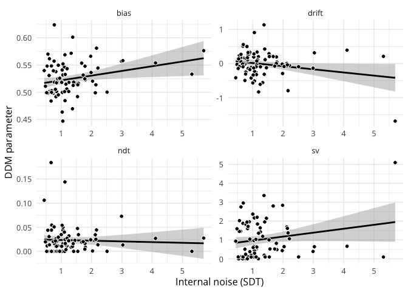
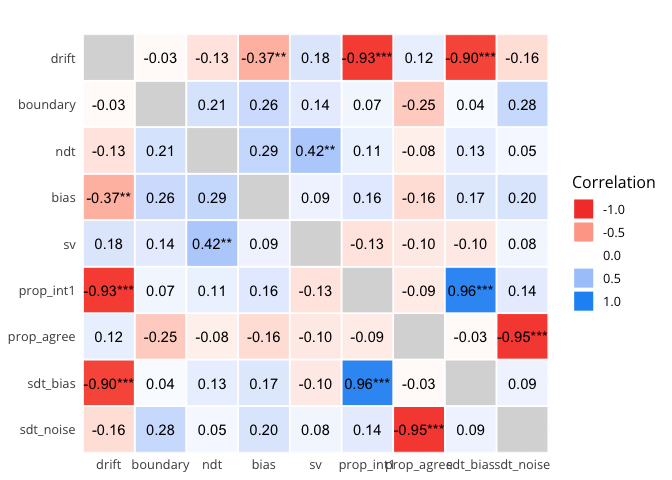
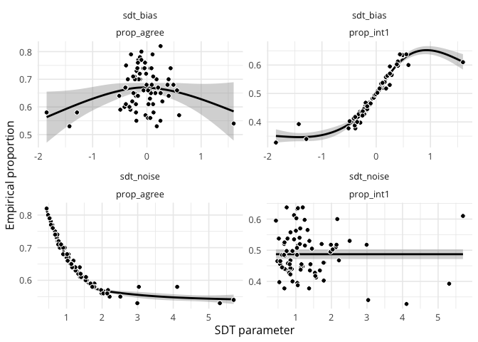

<!-- README.md is generated from README.Rmd. Please edit that file -->

# PALIN: Convert your PAs into INs

<!-- badges: start -->

<!-- badges: end -->

The goal of `palin` is to provide utilities for working with reverse
correlation data. It can be used, for instance, to estimate internal
noise in such tasks.

## Installation

You can install the development version of `palin` from GitHub with:

``` r
install.packages("remotes")

remotes::install_github(
    repo = "https://github.com/neuro-team-femto/palin/r",
    dependencies = TRUE
    )
```

## Usage

### Computing kernels

Below we compute kernels using various methods.

``` r
library(patchwork)
library(tidyverse)
library(palin)

# importing some reverse correlation data (self-produced speech)
data(self_voice)
head(self_voice)
#>   participant block trial resp    RT        f        eq
#> 1        01JM     1     1    0 0.298   0.0000  2.175316
#> 2        01JM     1     1    0 0.298 102.2548 -3.567088
#> 3        01JM     1     1    0 0.298 219.4468 -4.296887
#> 4        01JM     1     1    0 0.298 353.7580  1.499065
#> 5        01JM     1     1    0 0.298 507.6892  3.008010
#> 6        01JM     1     1    0 0.298 684.1064  1.302738

# computing the kernel via the difference method
diff_kernels <- computing_kernel(data = self_voice, method = "difference")
head(diff_kernels)
#>   participant        f           0           1 kernel_gain norm_gain1
#> 1        01JM 102.2548  0.01766484 -0.09270277  -0.1103676 -0.1404095
#> 2        01JM 219.4468  0.16504632  0.01236347  -0.1526829 -0.1942429
#> 3        01JM 353.7580  0.44920329 -0.67440862  -1.1236119 -1.4294572
#> 4        01JM 507.6892  0.71696975 -0.82346385  -1.5404336 -1.9597370
#> 5        01JM 684.1064  0.12811565  0.26302829   0.1349126  0.1716356
#> 6        01JM 886.2943 -0.39812361  0.50062065   0.8987443  1.1433809
#>     norm_gain2
#> 1 -0.009290513
#> 2 -0.012852521
#> 3 -0.094583286
#> 4 -0.129670460
#> 5  0.011356662
#> 6  0.075654401

# computing the kernel using a GLM
glm_kernels <- computing_kernel(data = self_voice, method = "glm")
head(glm_kernels)
#>   participant        f           0           1   kernel_gain  norm_gain1
#> 1        01JM 102.2548  0.01766484 -0.09270277  0.0026387012  0.23114206
#> 2        01JM 219.4468  0.16504632  0.01236347 -0.0005020698 -0.04397976
#> 3        01JM 353.7580  0.44920329 -0.67440862 -0.0147664496 -1.29349532
#> 4        01JM 507.6892  0.71696975 -0.82346385 -0.0209413868 -1.83440072
#> 5        01JM 684.1064  0.12811565  0.26302829  0.0062019345  0.54327029
#> 6        01JM 886.2943 -0.39812361  0.50062065  0.0205421896  1.79943228
#>    norm_gain2
#> 1  0.01544823
#> 2 -0.00293936
#> 3 -0.08644995
#> 4 -0.12260102
#> 5  0.03630913
#> 6  0.12026392

# plotting everything (see the doc via ?plot.kernel for possible normalisation_method values)
plot(diff_kernels, normalisation_method = "kernel_gain") +
    plot(glm_kernels, normalisation_method = "kernel_gain")
```


### Estimating internal noise

Computing response bias and internal noise from the percentage of
agreement.

``` r
# computing the percentage of agreement in the two double-pass blocks
self_voice |>
    filter(participant == unique(participant)[1]) |>
    filter(block %in% c(max(block)-1, max(block) ) ) |>
    select(-RT, -f, -eq) |>
    distinct() |>
    # reshaping the response variable as indicating int1 or int2
    mutate(
        resp = if_else(first(resp) == 1, 0, 1),
        .by = c(participant, trial)
        ) |>
    # removing duplicated rows
    distinct() |>
    # reshaping the trial variable
    mutate(trial = 1:n(), .by = c(participant, block) ) |>
    pivot_wider(names_from = block, values_from = resp, names_prefix = "block") |>
    # computing agreement
    dplyr::mutate(agreement = ifelse(pick(3) == pick(4), 1, 0) ) |>
    summarise(prop_agree = mean(agreement), ntrials = n_distinct(trial) ) |>
    data.frame()
#>   prop_agree ntrials
#> 1       0.66     100

# computing the percentage of response per stimulus order/position
self_voice |>
    filter(participant == unique(participant)[1]) |>
    filter(block < max(block) ) |>
    select(-RT, -f, -eq) |>
    distinct() |>
    mutate(
        stim_order = cumsum(resp != lag(resp, default = first(resp) ) ) + 1,
        .by = c(participant, block, trial)
        ) |>
    reframe(prop_stim_order = mean(resp), .by = stim_order) |>
    data.frame()
#>   stim_order prop_stim_order
#> 1          1           0.485
#> 2          2           0.515

# estimating internal noise for this  participant
df <- data.frame(prop_agree = 0.66, prop_int1 = 0.485, ntrials = 100)

# fitting the SDT model to these data (using DEoptim and all available cores)
fit_results <- sdt_fitting(data = df, maxit = 100)
summary(fit_results)
#> 
#> ***** summary of DEoptim object ***** 
#> best member   :  -0.05788 1.0107 
#> best value    :  0 
#> after         :  100 generations 
#> fn evaluated  :  2020 times 
#> *************************************
```

### Drift diffusion modelling

Fitting the drift diffusion model (DDM) to the responses and
distributions of RTs (after removing the last double-pass block).

``` r
library(fddm)

# reshaping the data
df <- self_voice |>
    # keeping only the first participant
    filter(participant == unique(self_voice$participant)[1]) |>
    # removing the last double-pass block
    filter(block < max(block) ) |>
    # keeping only the relevant columns
    select(participant, trial, resp, RT) |>
    # removing duplicated rows
    distinct() |>
    # reshaping the resp variable as indicating int1 or int2
    mutate(
        resp = if_else(first(resp) == 1, 0, 1),
        .by = c(participant, trial)
        ) |>
    distinct() |>
    # reshaping the resp variable
    mutate(resp = factor(ifelse(test = resp == 0, yes = "lower", no = "upper") ) ) |>
    # removing extreme RTs
    filter(RT > 0.05 & RT < 2)

# plotting the RT distribution
# hist(df$RT, breaks = "FD")

# fitting the full DDM for LN and MM (pars are a, v, t0, w, sv)
# pars are the threshold separation, drift rate, non-decision time, relative
# starting point, and inter-trial variability of drift rate
# verbose = 20 means that we want to print progress every 20 iterations
ddm_fit <- ddm_fitting(
    rt = df$RT,
    resp = df$resp,
    method = "DEoptim",
    maxit = 1e3
    )
summary(ddm_fit)
#> 
#> ***** summary of DEoptim object ***** 
#> best member   :  0.18992 1.71198 0.01568 0.46359 2.1835 
#> best value    :  291.0997 
#> after         :  1000 generations 
#> fn evaluated  :  50050 times 
#> *************************************

# comparing to the fit with ddm()
fddm_fit <- fddm::ddm(
    drift = RT + resp ~ 1,
    boundary = ~ 1,
    ndt = ~ 1,
    bias = ~ 1,
    sv = ~ 1,
    optim = "nlminb",
    args_optim = list(
        lo_bds = c(-5, 0, 0, 0, 0),
        up_bds = c(+5, 5, 5, 1, 5)
        ),
    data = df
    )
#> [1] "number of times we redid the initial parameters:"
#> [1] 0
#> t0[0] = 0.983849 >= 0.298
#> t0[58] = 0.103425 >= 0.103

# retrieving a summary
fddm_fit$coefficients
#> $drift
#> (Intercept) 
#>   0.1899164 
#> 
#> $boundary
#> (Intercept) 
#>    1.711982 
#> 
#> $ndt
#> (Intercept) 
#>  0.01568415 
#> 
#> $bias
#> (Intercept) 
#>   0.4635913 
#> 
#> $sv
#> (Intercept) 
#>    2.183505
fddm_fit$loglik
#> [1] -291.0997
```

### Comparing various estimates of internal noise

We can then correlate the parameters of the DDM to the parameters of the
SDT model.

``` r
# listing available participants
participants <- unique(self_voice$participant)

# initialising empty results
results <- data.frame()

# then, for each participant
for (i in 1:length(participants) ) {
    
    # printing progress
    # cat("\nAnalysing participant:", i, "out of", length(participants), "participants...\n\n")
    
    # retrieving the current participant
    current_ppt <- participants[i]
    
    # reshaping the data for this participant
    df <- self_voice |>
        # keeping only the current participant
        filter(participant == current_ppt) |>
        # removing the last double-pass block
        filter(block < max(block) ) |>
        # keeping only the relevant columns
        select(participant, trial, response = resp, RT) |>
        # removing duplicated rows
        distinct() |>
        # reshaping the response variable as indicating int1 or int2
        mutate(
            response = if_else(first(response) == 1, 0, 1),
            .by = c(participant, trial)
            ) |>
        distinct() |>
        # reshaping the response variable
        mutate(response = factor(ifelse(test = response == 0, yes = "lower", no = "upper") ) ) |>
        # removing extreme RTs
        filter(RT > 0.05 & RT < 2)
    
    # fitting the DDM
    ddm_fit <- fddm::ddm(
        drift = RT + response ~ 1,
        boundary = ~ 1,
        ndt = ~ 1,
        bias = ~ 1,
        sv = ~ 1,
        optim = "nlminb",
        args_optim = list(
            lo_bds = c(-5, 0, 0, 0, 0),
            up_bds = c(+5, 5, 5, 1, 5)
            ),
        data = df
        )
    
    # retrieving the between-trial variability and log-likelihood
    ddm_estimates <- data.frame(ddm_fit$coefficients) |>
        mutate(loglik = ddm_fit$loglik) |>
        mutate(participant = current_ppt)
    
    # removing the rownames
    rownames(ddm_estimates) <- NULL
    
    # computing the percentage of response per stimulus order/position
    prop_int1 <- self_voice |>
        filter(participant == current_ppt) |>
        filter(block < max(block) ) |>
        select(-RT, -f, -eq) |>
        distinct() |>
        mutate(
            stim_order = cumsum(resp != lag(resp, default = first(resp) ) ) + 1,
            .by = c(participant, block, trial)
            ) |>
        reframe(prop_stim_order = mean(resp), .by = stim_order) |>
        filter(stim_order == 1) |>
        pull(prop_stim_order)
    
    # computing the percentage of agreement
    agreement_df <- self_voice |>
        dplyr::filter(participant == current_ppt) |>
        dplyr::filter(block %in% c(max(block)-1, max(block) ) ) |>
        # select(-RT, -trial) |>
        select(-RT, -f, -eq) |>
        # reshaping the response variable as indicating int1 or int2
        mutate(
            resp = if_else(first(resp) == 1, 0, 1),
            .by = c(participant, trial)
            ) |>
        # removing duplicated rows
        distinct() |>
        # reshaping the trial variable
        mutate(trial = 1:n(), .by = c(participant, block) ) |>
        pivot_wider(names_from = block, values_from = resp, names_prefix = "block") |>
        # computing agreement
        dplyr::mutate(agreement = ifelse(pick(3) == pick(4), 1, 0) ) |>
        summarise(prop_agree = mean(agreement), ntrials = n_distinct(trial) ) |>
        data.frame()

    # estimating internal noise for this  participant
    sdt_df <- data.frame(
        prop_agree = agreement_df$prop_agree,
        prop_int1 = prop_int1,
        ntrials = agreement_df$ntrials
        )
    
    # fitting the SDT model to these data (using DEoptim and all available cores)
    sdt_fit_results <- sdt_fitting(data = sdt_df, maxit = 100)
    
    # collecting results for this participant
    this_participant_results <- ddm_estimates |>
        mutate(
            prop_int1 = prop_int1,
            prop_agree = agreement_df$prop_agree,
            ntrials = agreement_df$ntrials,
            sdt_bias = as.numeric(sdt_fit_results$optim$bestmem[1]),
            sdt_noise = as.numeric(sdt_fit_results$optim$bestmem[2]),
            sdt_error = sdt_fit_results$optim$bestval
            ) |>
        relocate(participant, 1)

    # binding results for the current participant to previous results
    results <- bind_rows(results, this_participant_results)
    
}

# plotting the relation between the internal noise (SDT) and DDM parameters
results |>
    # removing some aberrant values
    filter(sdt_noise < 6) |>
    # pivot_longer(cols = drift:sv, names_to = "ddm_pars") %>%
    pivot_longer(cols = c(drift, bias, ndt, sv), names_to = "ddm_pars") |>
    ggplot(aes(x = sdt_noise, y = value) ) +
    geom_smooth(method = "lm", colour = "black") +
    geom_point(pch = 21, size = 2, colour = "white", fill = "black") +
    facet_wrap(~ddm_pars, scales = "free", ncol = 2) +
    theme_minimal(base_size = 12, base_family = "Open Sans") +
    labs(x = "Internal noise (SDT)", y = "DDM parameter")
```



``` r

# computing the correlation matrix between SDT and DDM parameters
library(correlation)
correlation_matrix <- results |>
    select(-loglik, -ntrials, -sdt_error) |>
    correlation(method = "spearman")

# plotting it
correlation_matrix |>
    summary(redundant = TRUE, digits = 2) |>
    # visualisation_recipe() |>
    plot() +
    labs(title = "") +
    theme_minimal(base_size = 12, base_family = "Open Sans")
```



``` r

# plotting the relation between SDT parameters and empirical proportions
# plotting the relation between the internal noise (SDT) and DDM parameters
results |>
    # removing some aberrant values
    filter(sdt_noise < 6) |>
    # reshaping the data
    select(-drift, -boundary, -ndt, -bias, -sv, -loglik, -ntrials, -sdt_error) |>
    pivot_longer(cols = c(sdt_bias, sdt_noise), names_to = "sdt_pars", values_to = "sdt_value") |>
    pivot_longer(cols = c(prop_int1, prop_agree), names_to = "props", values_to = "props_value") |>
    ggplot(aes(x = sdt_value, y = props_value) ) +
    geom_smooth(method = "gam", colour = "black") +
    geom_point(pch = 21, size = 2, colour = "white", fill = "black") +
    facet_wrap(sdt_pars~props, scales = "free") +
    theme_minimal(base_size = 12, base_family = "Open Sans") +
    labs(x = "SDT parameter", y = "Empirical proportion")
```



### Computing continous metrics of response consistency

``` r
# computing average consistency per participant and block
consistency <- response_consistency(data = self_voice)

# plotting it
consistency %>%
    pivot_longer(cols = avg_consistency:weighted_avg_consistency) %>%
    ggplot(aes(x = block, y = value, colour = name) ) +
    geom_line(
        aes(group = interaction(participant, name) ),
        linewidth = 0.5,
        alpha = 0.2,
        show.legend = FALSE
        ) +
    stat_summary(
        geom = "line",
        fun = median, linewidth = 1,
        show.legend = FALSE
        ) +
    facet_wrap(~name, ncol = 1) +
    theme_minimal(base_size = 12, base_family = "Open Sans") +
    labs(x = "Block number", y = "Average consistency")
```


