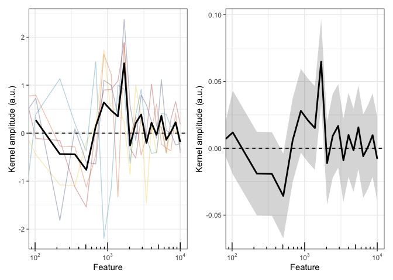
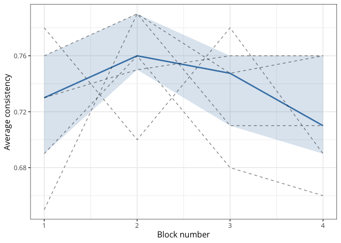

<!-- README.md is generated from README.Rmd. Please edit that file -->

# PALIN: Convert your PAs into INs

<!-- badges: start -->

<!-- badges: end -->

The goal of `palin` is to provide utilities for working with reverse
correlation data. It can be used, for instance, to estimate internal
noise (IN) from empirical percentages of agreement (PA) in such tasks.

## Installation

You can install the development version of `palin` from GitHub with:

``` r
install.packages("remotes")

remotes::install_github(
    repo = "https://github.com/neuro-team-femto/palin/r",
    dependencies = TRUE
    )
```

## Usage

### Computing kernels

Below we compute kernels using various methods.

``` r
library(patchwork)
library(tidyverse)
library(palin)

# import some reverse correlation data (self-produced speech)
data(self_voice)
head(self_voice)
#>   participant block trial response    RT  feature     value
#> 1        01JM     1     1        0 0.298   0.0000  2.175316
#> 2        01JM     1     1        0 0.298 102.2548 -3.567088
#> 3        01JM     1     1        0 0.298 219.4468 -4.296887
#> 4        01JM     1     1        0 0.298 353.7580  1.499065
#> 5        01JM     1     1        0 0.298 507.6892  3.008010
#> 6        01JM     1     1        0 0.298 684.1064  1.302738

# compute the kernel via the difference method
diff_kernels <- computing_kernel(data = self_voice, method = "difference")
head(diff_kernels)
#>   participant  feature    negative    positive kernel_gain norm_kernel_gain
#> 1        01JM   0.0000 -0.38232369  0.14785399   0.5301777        0.6834186
#> 2        01JM 102.2548  0.01766484 -0.09270277  -0.1103676       -0.1422679
#> 3        01JM 219.4468  0.16504632  0.01236347  -0.1526829       -0.1968138
#> 4        01JM 353.7580  0.44920329 -0.67440862  -1.1236119       -1.4483773
#> 5        01JM 507.6892  0.71696975 -0.82346385  -1.5404336       -1.9856759
#> 6        01JM 684.1064  0.12811565  0.26302829   0.1349126        0.1739074

# compute the kernel using a GLM
glm_kernels <- computing_kernel(data = self_voice, method = "GLM")
head(glm_kernels)
#>        feature       kernel        lower        upper
#> 1            0  0.006920131 -0.006040969  0.019892897
#> 2 102.25480495  0.011869046 -0.019442771  0.043196640
#> 3 219.44681723 -0.018932548 -0.050210661  0.012335792
#> 4  353.7580386 -0.019160194 -0.050435179  0.012104649
#> 5 507.68921389 -0.035676451 -0.067351520 -0.004027084
#> 6 684.10639247  0.006127961 -0.025210484  0.037477517

# plot everything (see the doc via ?plot.kernel)
plot(diff_kernels, normalisation_method = "kernel_gain") +
    plot(glm_kernels, normalisation_method = "kernel_gain")
```



### Estimating internal noise

Computing response bias and internal noise from the percentage of
agreement.

``` r
# filter and reshape the double-pass data
sdt_df <- self_voice |>
    filter(participant == unique(participant)[1]) |>
    filter(block %in% c(max(block)-1, max(block) ) ) |>
    select(-RT, -feature, -value) |>
    distinct() |>
    # reshape the response variable as indicating int1 or int2
    mutate(
        response = if_else(
            condition = first(response) == 0,
            true = "stim1",
            false = "stim2"
            ),
        .by = c(participant, block, trial)
        ) |>
    mutate(trial = 1:n(), .by = block) |>
    pivot_wider(names_from = block, values_from = response) |>
    rename("block1" = `4`, "block2" = `5`)

# fit with the SDT model to double-pass responses
sdt_fit <- sdt_fitting(
    data = sdt_df,
    ntrials = nrow(sdt_df)
    )

# print point estimates with profile-likelihood confidence intervals
sdt_fit$confint
#>        parameter  estimate lower upper level hits_lower_bound hits_upper_bound
#> 1           bias 0.6652513  0.42  1.08  0.95            FALSE            FALSE
#> 2 internal_noise 1.2654504  0.88  2.22  0.95            FALSE            FALSE

# fit with the SDT model to double-pass summarise (MSE loss function)
# df <- data.frame(prop_agree = 0.66, prop_first = 0.485, ntrials = 100)
# fit_results <- sdt_fitting(data = df, loss = "mse", maxit = 200)
# summary(fit_results)
```

### Drift diffusion modelling

Fitting the drift diffusion model (DDM) to the responses and
distributions of RTs (after removing the last double-pass block).

``` r
library(fddm)

# reshape the data
df <- self_voice |>
    # keep only the first participant
    filter(participant == unique(self_voice$participant)[1]) |>
    # remove the last double-pass block
    filter(block < max(block) ) |>
    # keep only the relevant columns
    select(participant, trial, response, RT) |>
    # remove duplicated rows
    distinct() |>
    # reshape the resp variable as indicating int1 or int2
    mutate(
        resp = if_else(first(response) == 1, 0, 1),
        .by = c(participant, trial)
        ) |>
    distinct() |>
    # reshape the resp variable
    mutate(resp = factor(ifelse(test = response == 0, yes = "lower", no = "upper") ) ) |>
    # remove extreme RTs
    filter(RT > 0.05 & RT < 2)

# visualise the RT distribution
# hist(df$RT, breaks = "FD")

# fit the full DDM (pars are a, v, t0, w, sv)
# parameters are the threshold separation, drift rate, non-decision time,
# relative starting point, and inter-trial variability of drift rate
# verbose = 20 means that we want to print progress every 20 iterations
ddm_fit <- ddm_fitting(
    rt = df$RT,
    resp = df$resp,
    method = "DEoptim",
    maxit = 1e3
    )
summary(ddm_fit)
#> 
#> ***** summary of DEoptim object ***** 
#> best member   :  0 1.7089 0.01503 0.5 2.17958 
#> best value    :  585.5875 
#> after         :  1000 generations 
#> fn evaluated  :  50050 times 
#> *************************************

# compare to the fit with ddm()
fddm_fit <- fddm::ddm(
    drift = RT + resp ~ 1,
    boundary = ~ 1,
    ndt = ~ 1,
    bias = ~ 1,
    sv = ~ 1,
    optim = "nlminb",
    args_optim = list(
        lo_bds = c(-5, 0, 0, 0, 0),
        up_bds = c(+5, 5, 5, 1, 5)
        ),
    data = df
    )

# retrieve a summary
fddm_fit$coefficients
#> $drift
#>   (Intercept) 
#> -1.512902e-06 
#> 
#> $boundary
#> (Intercept) 
#>    1.371041 
#> 
#> $ndt
#> (Intercept) 
#>   0.0243788 
#> 
#> $bias
#> (Intercept) 
#>   0.5000006 
#> 
#> $sv
#> (Intercept) 
#>           0
fddm_fit$loglik
#> [1] -594.7426
```

### Computing continuous metrics of response consistency

``` r
# compute average consistency per participant and block
consistency <- response_consistency(
    data = self_voice,
    method = "template_distance",
    double_pass = TRUE
    )

# plot it
consistency %>%
    ggplot(aes(x = block, y = avg_consistency) ) +
    stat_summary(
        fun.data = median_hilow,
        # display the 50% central quantiles
        fun.args = list(conf.int = 0.5),
        geom = "ribbon", 
        fill = "steelblue",
        alpha = 0.2
        ) +
    stat_summary(
        geom = "line",
        fun = median,
        linewidth = 1,
        colour = "steelblue",
        show.legend = FALSE
        ) +
    geom_line(
        aes(group = participant),
        linewidth = 0.5,
        linetype = 2,
        alpha = 0.5,
        show.legend = FALSE
        ) +
    scale_x_continuous(breaks = seq(min(consistency$block), max(consistency$block), by = 1) ) +
    theme_bw(base_size = 12, base_family = "Open Sans") +
    labs(x = "Block number", y = "Average consistency")
```


